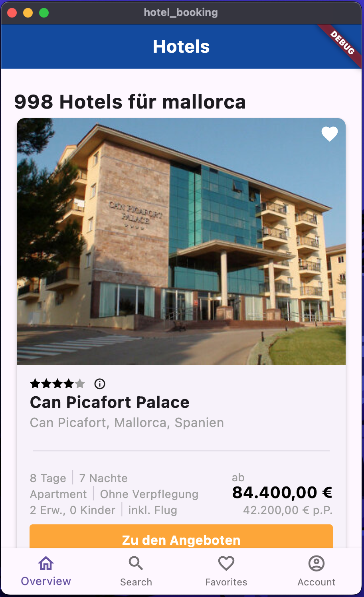
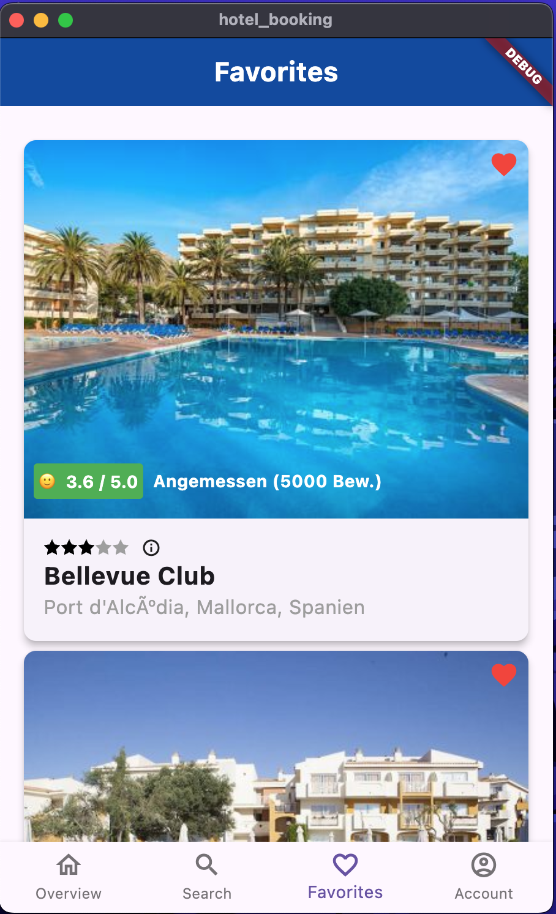
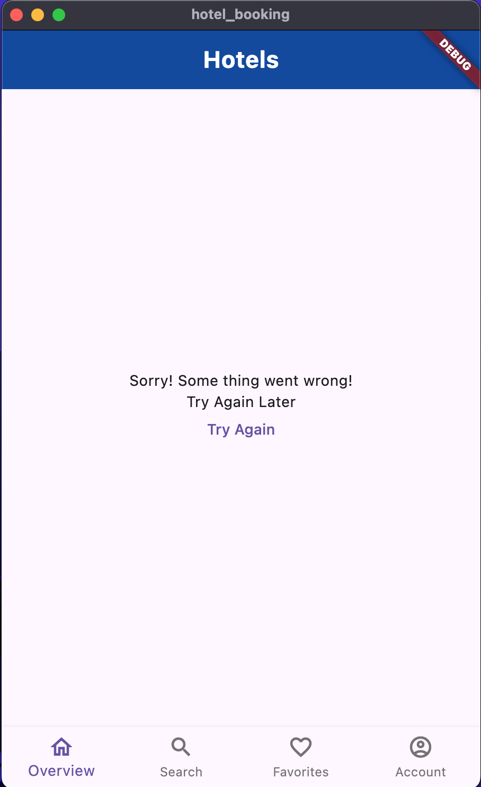

# Flutter Hotel Booking App

## Objective
This project is a simple hotel booking app built using Flutter, designed as part of a coding assignment. The app features a bottom navigation bar with four tabs: **Overview**, *Search*, **Favorites**, and *Account*. Each tab implements the necessary functionality, with a focus on state management, error handling, and navigation.

## Features
### 1. Bottom Navigation Bar
- Four tabs: **Overview**, *Search*, **Favorites**, *Account*.

### 2. Hotels Tab
- Displays hotel cards fetched from an API.
- Shows a loading spinner while fetching hotel data.
- Displays an error screen if the API call fails.
- [API used for hotel data](https://dkndmolrswy7b.cloudfront.net/hotels.json).

### 3. Favorites Tab
- Allows users to favorite/unfavorite hotels by tapping the heart icon.
- Displays the list of favorite hotels.
- Favorites are stored locally (using **Hive**).

### 4. Error Handling
- A simple error state is displayed if fetching hotels fails.

### 5. App Design
- Follows the design provided via Figma.
- Simple placeholders are used for loading and error states.

## App Architecture
The app is built following **Clean Architecture**, with clear separation of concerns into the following layers:
- **Data Layer**: Handles API calls, local data storage, and repositories.
- **Domain Layer**: Contains business logic and interacts with the data layer via use cases.
- **Presentation Layer**: Consists of UI components and state management using **BLoC** to handle different app states such as loading, success, and error.

### State Management
The **BLoC** pattern is used to manage app states efficiently. It handles API calls, updates UI states (loading, error, success), and manages the state of favorited hotels locally.

### Navigation
Implemented using the **Auto Route** package to handle tab-based navigation as well as deep linking.

### Local Storage
- **Hive** is used for local storage to store favorited hotels.

## Running the App
### Prerequisites
- [Flutter](https://flutter.dev/docs/get-started/install) SDK.
- A suitable editor like **VS Code** or **Android Studio**.
  
### Setup Instructions
1. Clone the repository:  
   ```bash
   git clone https://github.com/yourusername/flutter-hotel-booking.git
   ```
2. Navigate to the project directory:
   ```bash
   cd flutter-hotel-booking
   ```
3. Install dependencies:
   ```bash
   flutter pub get
   ```
4. Run the app:
   ```bash
   flutter run
   ```

### Testing
To run the unit and widget tests, use the following command:
```bash
flutter test
```

The app includes:
- **Unit tests** for the business logic.
- **Widget tests** to verify UI behavior.

**Note**: I have written different types of tests to showcase my skills in testing Flutter applications. However, I acknowledge that this project would benefit from more comprehensive test coverage, especially in areas such as edge cases and error handling.

## Screenshots
| Hotels Tab  | Favorites Tab | Error State |
|-------------|---------------|-------------|
|  |  |  |

## Key Design Decisions
1. **BLoC for State Management**: Chosen for its robustness and clear separation of UI and business logic.
2. **Hive for Local Storage**: Hive offers a lightweight and easy-to-use database solution to store and retrieve favorited hotels.
3. **Auto Route for Navigation**: Simplifies navigation, especially for managing deep links and tab-based routing.
4. **Clean Architecture**: Ensures maintainability, testability, and scalability, following the separation of concerns principle.

## Areas for Improvement
1. **More Tests**: While I have included various tests, the project could benefit from more comprehensive unit and widget tests.
2. **Performance Optimization**: Adding caching for API responses would help optimize data loading performance.
3. **Localization**: The app currently lacks multi-language support but can be extended to include localization in the future.
